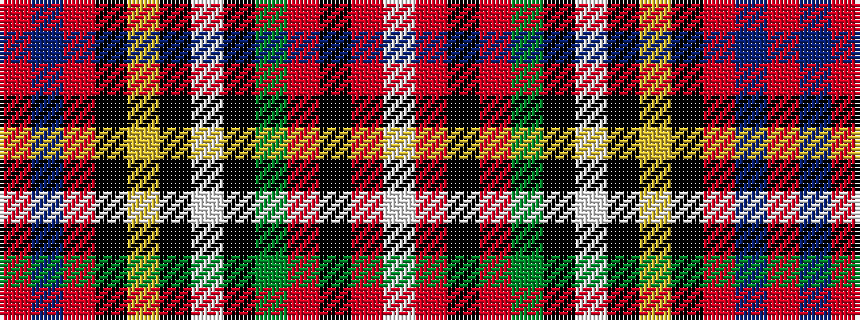

RBRKYKWKGRKRW

It is a 13 stripe tartan.

<figure class="pat-woven">

<figcaption>idealised sample</figcaption>
</figure>

## Colour Sequence



## Tartans with this colour sequence

| Tartans |
|---------------|
| [Prince Albert](/tartans/r3db9r2k7ly2k2w2k2g6r5k2r2w2/)|
||
| [Prince Albert #2](/setts/s13/r3db9r2k7ly2k2w2k2dg6r5k2r2w2~x2/)|
||
