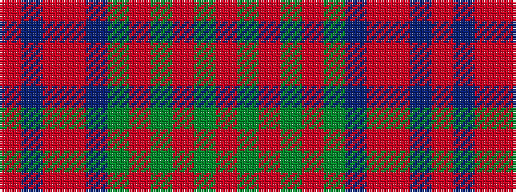

RBRRBGRGRGR

It is a 11 stripe tartan.

<figure class="pat-woven">

<figcaption>idealised sample</figcaption>
</figure>

## Colour Sequence



## Tartans with this colour sequence

| Tartans |
|---------------|
| [Bonnie Brae (School)](/setts/s11/o6dg3o3dg3o3dg24db20oi24o3db3oi6/)|
||
| [Bonnie Brae School](/setts/s11/r6db3o3r24db20dg24o3dg3o3dg3o6/)|
||
