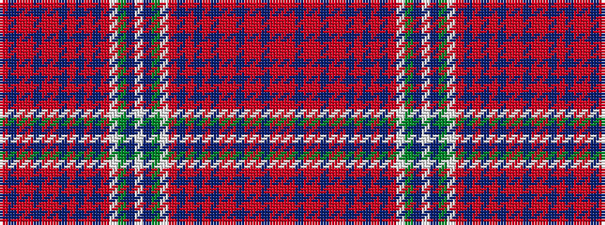

RBRRBRRBRBRBRWGBWBGWRBRBRBRRBRRBRR

It is a 34 stripe tartan.

<figure class="pat-woven">

<figcaption>idealised sample</figcaption>
</figure>

## Colour Sequence



## Tartans with this colour sequence

| Tartans |
|---------------|
| [Unidentified Cant #13](/variants/s34/r44m4db16r4m6db8m6r6db2r4db2r4db2r6w1g24t6w1/)|
||
