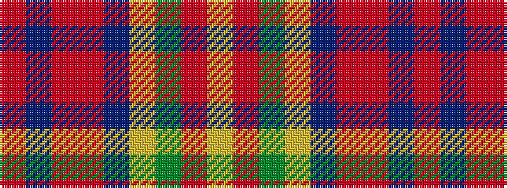

RBRRBYGRY

It is a 9 stripe tartan.

<figure class="pat-woven">

<figcaption>idealised sample</figcaption>
</figure>

## Colour Sequence



## Tartans with this colour sequence

| Tartans |
|---------------|
| [Down](/variants/s9/o65dr9r11o5t2lo2y5o2lo13~x2/)|
||
