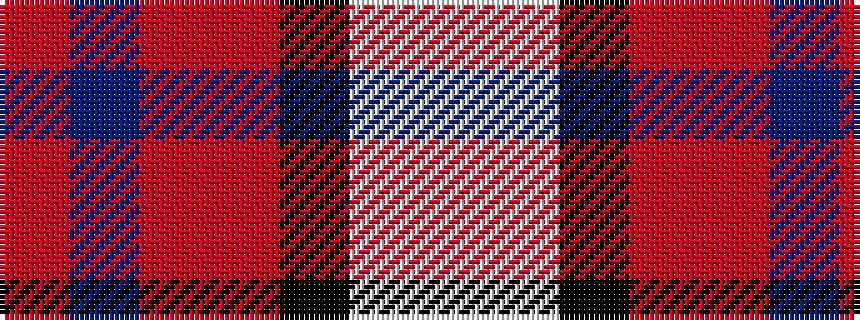

RBRRKWW

It is a 7 stripe tartan.

<figure class="pat-woven">

<figcaption>idealised sample</figcaption>
</figure>

## Colour Sequence



## Tartans with this colour sequence

| Tartans |
|---------------|
| [Bombeiros Voluntarios De Galicia (Co](/setts/s7/r3n2r25o12k25w2lb2~x2/)|
||
