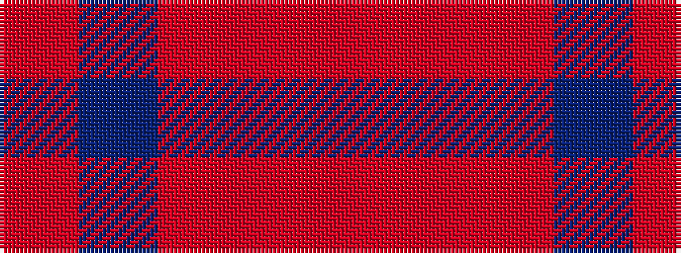

RBRRR

It is a 5 stripe tartan.

<figure class="pat-woven">

<figcaption>idealised sample</figcaption>
</figure>

## Colour Sequence



## Tartans with this colour sequence

| Tartans |
|---------------|
| [Ferguson Britt Red (Corporate)](/setts/s5/r4db24ri21r21ri4~x2/)|
||
| [New Exeter Check (Fashion)](/setts/s5/r8n13r8r13r8/)|
||
