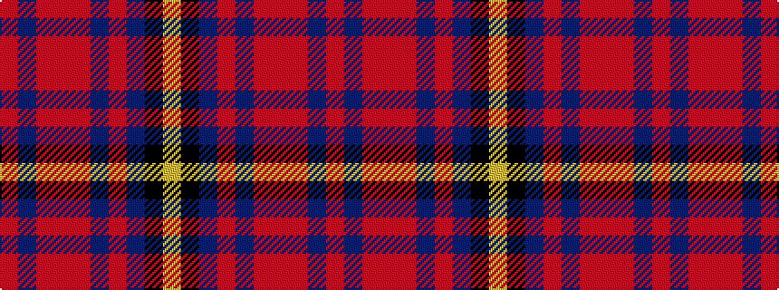

RBRRRBRBKY

It is a 10 stripe tartan.

<figure class="pat-woven">

<figcaption>idealised sample</figcaption>
</figure>

## Colour Sequence



## Tartans with this colour sequence

| Tartans |
|---------------|
| [Chang-Miller (Personal)](/variants/s10/r23db2r1o2r1db2r4db10k2lo2~x2/)|
||
