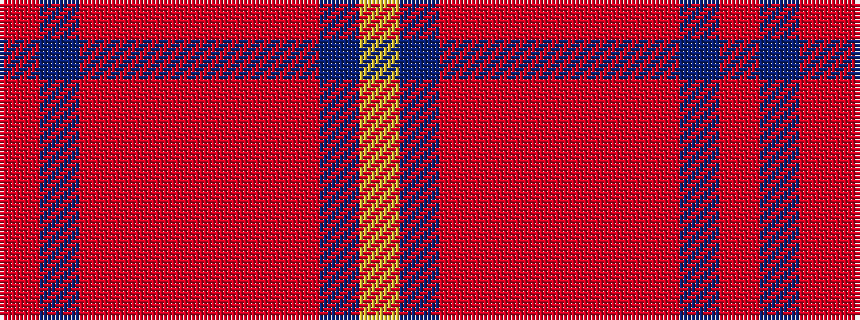

RBRRRRRRBY

It is a 10 stripe tartan.

<figure class="pat-woven">

<figcaption>idealised sample</figcaption>
</figure>

## Colour Sequence



## Tartans with this colour sequence

| Tartans |
|---------------|
| [FC Barcelona (Corporate)](/setts/s10/ri3b3ri18r2ri2r3ri2r4b18ly2~x2/)|
||
