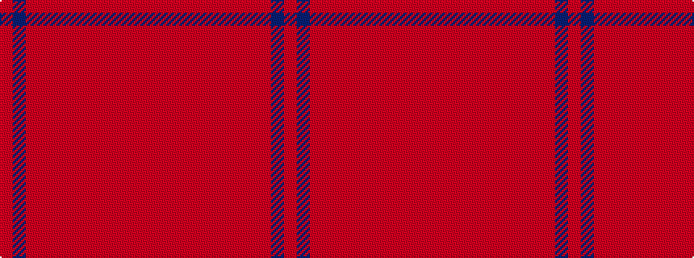

RBRRRRRRRRRR

It is a 12 stripe tartan.

<figure class="pat-woven">

<figcaption>idealised sample</figcaption>
</figure>

## Colour Sequence



## Tartans with this colour sequence

| Tartans |
|---------------|
| [Ferguson Red, George (Personal)](/variants/s12/ri8riii22r2riii8r4riii6r6riii3r48riii6dr48rii8/)|
||
