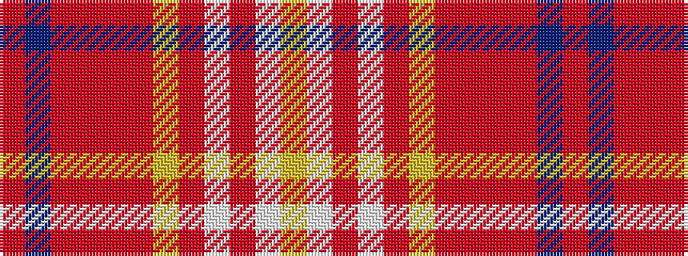

RBRRRRYRWRWY

It is a 12 stripe tartan.

<figure class="pat-woven">

<figcaption>idealised sample</figcaption>
</figure>

## Colour Sequence



## Tartans with this colour sequence

| Tartans |
|---------------|
| [Rathmore Family Tartan](/variants/s12/r26t2r6o2r2o2lo2o9w5ri2w4lo2~x2/)|
||
