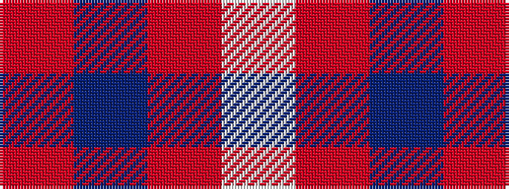

RBRW

It is a 4 stripe tartan.

<figure class="pat-woven">

<figcaption>idealised sample</figcaption>
</figure>

## Colour Sequence



## Tartans with this colour sequence

| Tartans |
|---------------|
| [Bloomer-Alexander (Personal)](/setts/s4/o16dr21r32w16~x2/)|
||
