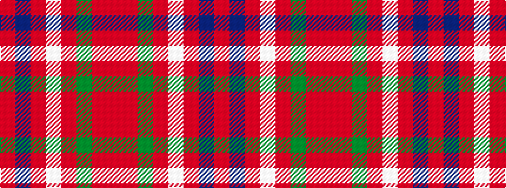

RBRWRGRR

It is a 8 stripe tartan.

<figure class="pat-woven">

<figcaption>idealised sample</figcaption>
</figure>

## Colour Sequence



## Tartans with this colour sequence

| Tartans |
|---------------|
| [Burnett of Leys Htg (Clan)](/setts/s8/ri75db6ri6w2ri6g2ri6r2~x2/)|
||
| [Burnett of Leys Hunting](/setts/s8/ri92db10ri8w3ri8g4ri8r4~x2/)|
||
| [Burnett, of Leys hunting](/setts/s8/o96db8o8w3o8g3o8r3~x2/)|
||
