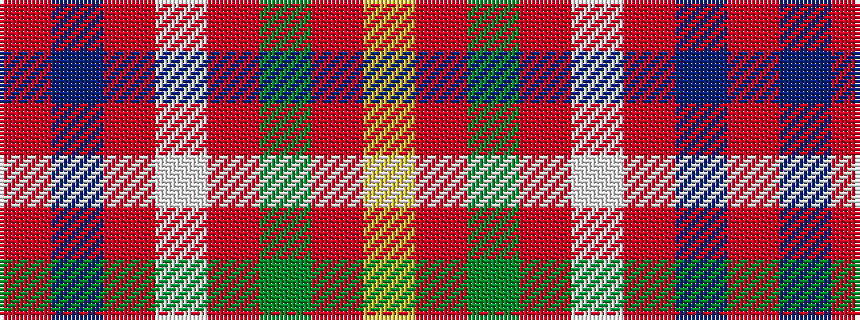

RBRWRGRY

It is a 8 stripe tartan.

<figure class="pat-woven">

<figcaption>idealised sample</figcaption>
</figure>

## Colour Sequence



## Tartans with this colour sequence

| Tartans |
|---------------|
| [Burnett of Leys](/setts/s8/r92db10r8w3r8g4r8lo3~x2/)|
||
| [Burnett of Leys (Clan)](/setts/s8/r75db6r6w2r6g2r6lo2~x2/)|
||
| [Burnett, of Leys](/setts/s8/r60db5r5w2r5g2r5ly2~x2/)|
||
