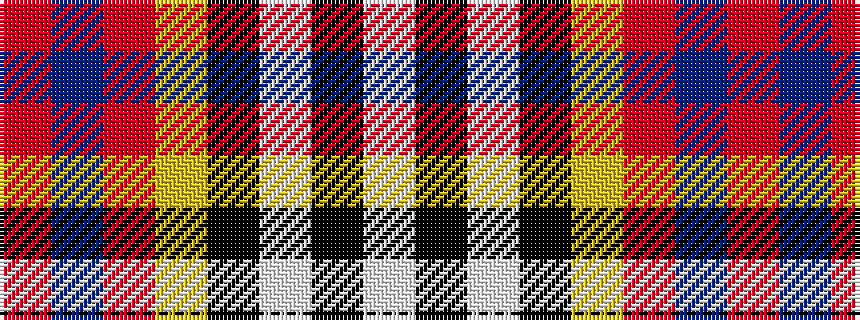

RBRYKWKW

It is a 8 stripe tartan.

<figure class="pat-woven">

<figcaption>idealised sample</figcaption>
</figure>

## Colour Sequence



## Tartans with this colour sequence

| Tartans |
|---------------|
| [Humming Bird (Fashion)](/setts/s8/r6t3m20ly2k20w20k2w5~x2/)|
||
