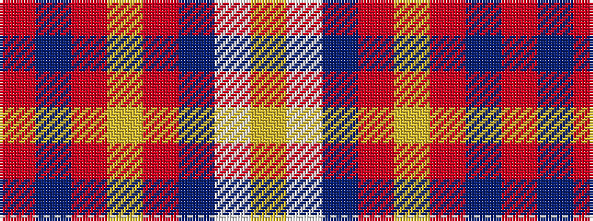

RBRYRBWY

It is a 8 stripe tartan.

<figure class="pat-woven">

<figcaption>idealised sample</figcaption>
</figure>

## Colour Sequence



## Tartans with this colour sequence

| Tartans |
|---------------|
| [Citylink Gold (Corporate)](/variants/s8/r25n2r3lo2r3n11w13lo1~x2/)|
||
