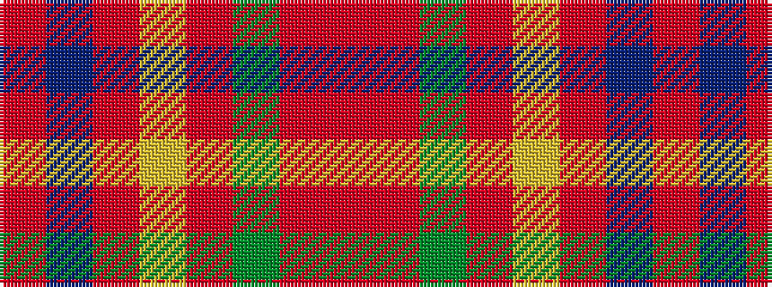

RBRYRGRR

It is a 8 stripe tartan.

<figure class="pat-woven">

<figcaption>idealised sample</figcaption>
</figure>

## Colour Sequence



## Tartans with this colour sequence

| Tartans |
|---------------|
| [De Nardi (Personal)](/setts/s8/r68db26r5ly3r5g3r13o3~x2/)|
||
