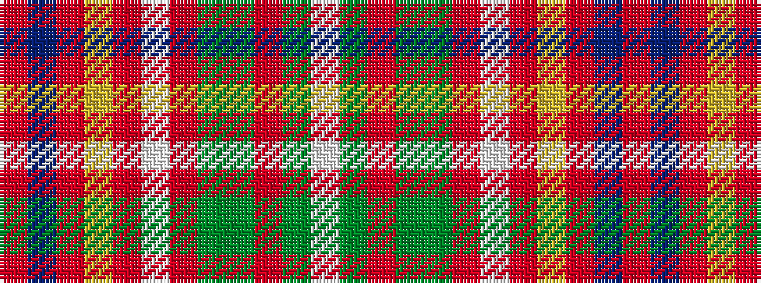

RBRYRWRGGRGW

It is a 12 stripe tartan.

<figure class="pat-woven">

<figcaption>idealised sample</figcaption>
</figure>

## Colour Sequence



## Tartans with this colour sequence

| Tartans |
|---------------|
| [Stuart Silver Commemorative Tartan](/variants/s12/o60t5o8ly2o4w2o4g16dy8o2dy4w2~x2/)|
||
