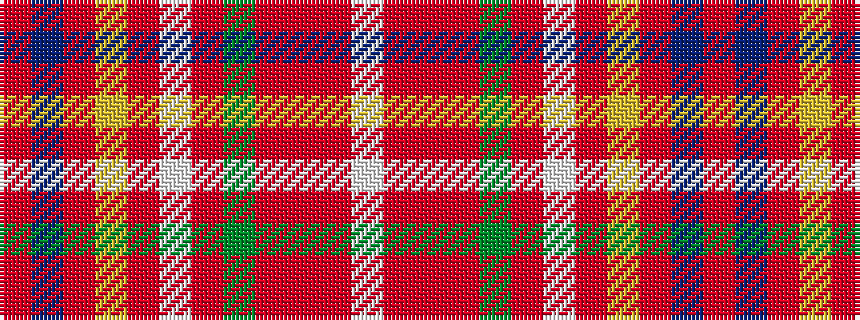

RBRYRWRGRRRW

It is a 12 stripe tartan.

<figure class="pat-woven">

<figcaption>idealised sample</figcaption>
</figure>

## Colour Sequence



## Tartans with this colour sequence

| Tartans |
|---------------|
| [Wcwm 1286-9](/setts/s12/ri42db3ri6lo2ri2lb2ri2g14r8ri2r3lb2~x2/)|
||
