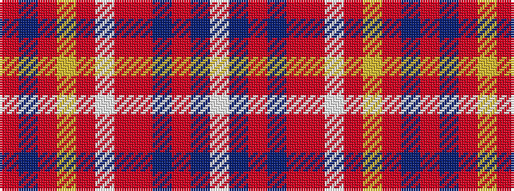

RBRYRWRRBRBW

It is a 12 stripe tartan.

<figure class="pat-woven">

<figcaption>idealised sample</figcaption>
</figure>

## Colour Sequence



## Tartans with this colour sequence

| Tartans |
|---------------|
| [Portree](/setts/s12/o20b4o12ly2o4w3o4r18do10o2do4w2~x2/)|
||
| [Portree Check](/setts/s12/o38db4o8lo2o4w3o4r14n7o2n4w2~x2/)|
||
