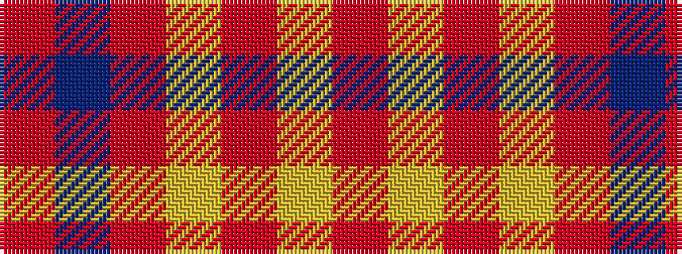

RBRYRYR

It is a 7 stripe tartan.

<figure class="pat-woven">

<figcaption>idealised sample</figcaption>
</figure>

## Colour Sequence



## Tartans with this colour sequence

| Tartans |
|---------------|
| [U.S. Merchant Marine Academy (Corpo](/variants/s7/o37lo2r6lo2o8db49o3~x2/)|
||
