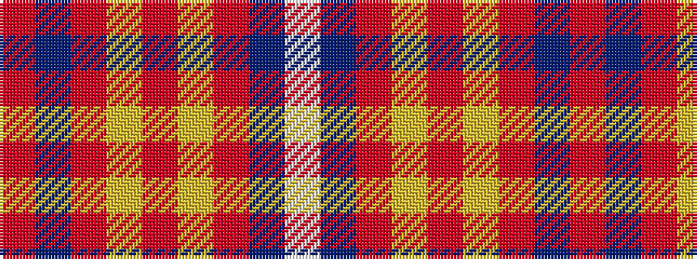

RBRYRYRBW

It is a 9 stripe tartan.

<figure class="pat-woven">

<figcaption>idealised sample</figcaption>
</figure>

## Colour Sequence



## Tartans with this colour sequence

| Tartans |
|---------------|
| [Khosla, Sarah and Jatin (Personal)](/setts/s9/m4dt10mi18ly3mi3ly5r8dt9w4~x2/)|
||
