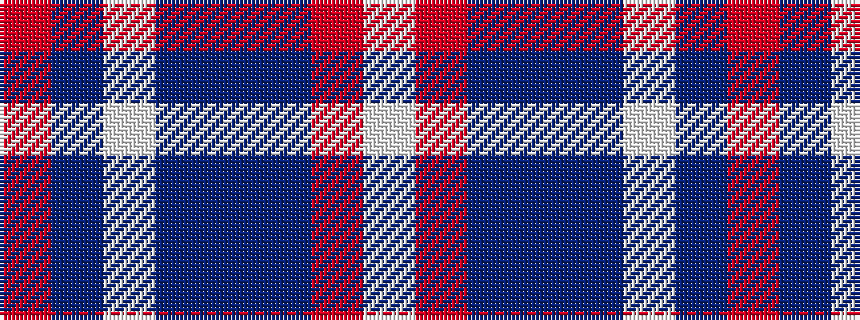

RBWBBBRW

It is a 8 stripe tartan.

<figure class="pat-woven">

<figcaption>idealised sample</figcaption>
</figure>

## Colour Sequence



## Tartans with this colour sequence

| Tartans |
|---------------|
| [BABC](/setts/r3dt4w2dt33db32dt2r4w3/)|
||
