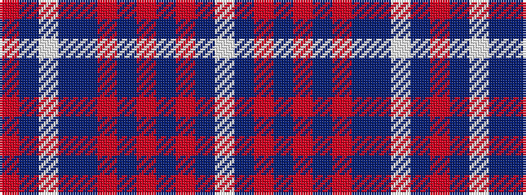

RBWBBRBRBRBW

It is a 12 stripe tartan.

<figure class="pat-woven">

<figcaption>idealised sample</figcaption>
</figure>

## Colour Sequence



## Tartans with this colour sequence

| Tartans |
|---------------|
| [Shotts & Dykehead (Corporate)](/setts/s12/w10db2r3dbi2r2db2r2n14db22w2db6r2~x2/)|
||
