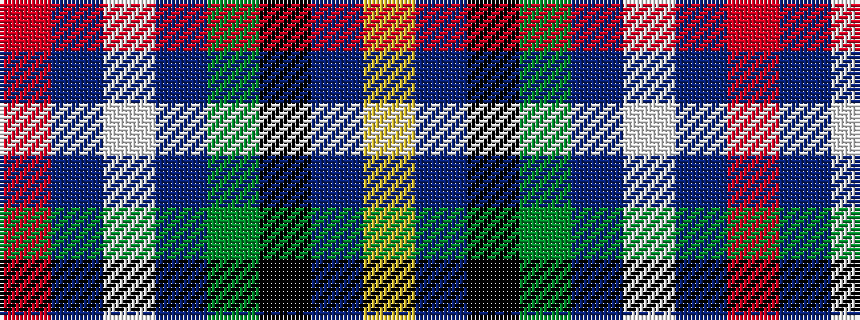

RBWBGKBY

It is a 8 stripe tartan.

<figure class="pat-woven">

<figcaption>idealised sample</figcaption>
</figure>

## Colour Sequence



## Tartans with this colour sequence

| Tartans |
|---------------|
| [Johnston, Diana Hunting (Personal)](/setts/s8/ly3dt1k2dg26dt28w1dt1r2~x2/)|
||
| [Johnston, Diana Hunting (Personal)](/setts/s8/ly3db1k2g26db28w1db1r2~x2/)|
||
