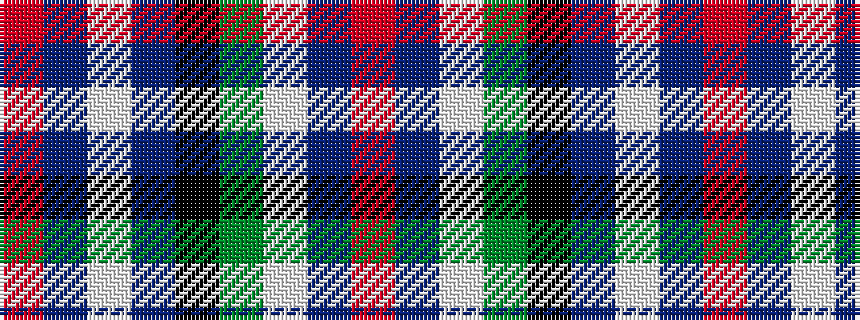

RBWBKGWBR

It is a 9 stripe tartan.

<figure class="pat-woven">

<figcaption>idealised sample</figcaption>
</figure>

## Colour Sequence



## Tartans with this colour sequence

| Tartans |
|---------------|
| [MacNaughton Dress](/setts/s9/r2db2w26g25k14db13w26db2r2~x2/)|
||
