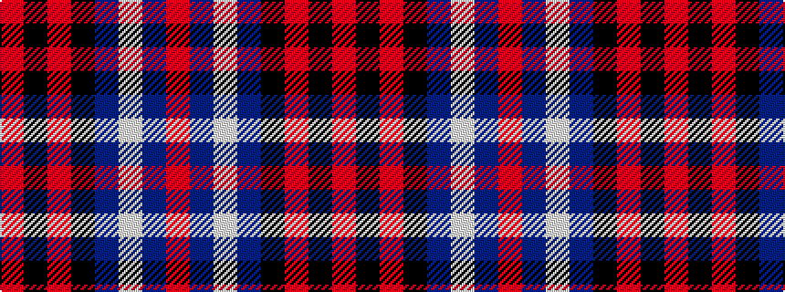

RBWBKRKR

It is a 8 stripe tartan.

<figure class="pat-woven">

<figcaption>idealised sample</figcaption>
</figure>

## Colour Sequence



## Tartans with this colour sequence

| Tartans |
|---------------|
| [MacKean](/variants/s8/r2k4r2k4db1w1db4r1~x4/)|
||
| [MacKean Red (Personal)](/variants/s8/r2k4r2k4db1lb1db4r1~x4/)|
||
