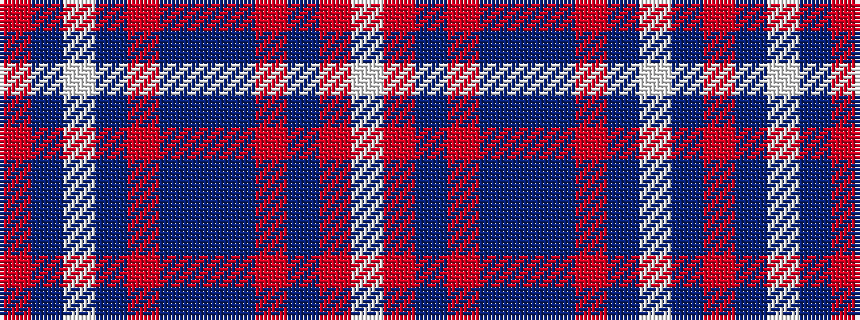

RBWBRBBBRBRW

It is a 12 stripe tartan.

<figure class="pat-woven">

<figcaption>idealised sample</figcaption>
</figure>

## Colour Sequence



## Tartans with this colour sequence

| Tartans |
|---------------|
| [Ramblers Red Hat Society](/setts/s12/w4r2dp2r2dp2dp38dp2r12dp2w1dp3r2~x2/)|
||
| [Ramblers Red Hat Society (Corporate)](/setts/s12/w4r2dp2r2b2dp38b2r12dp2w1dp3r2~x2/)|
||
