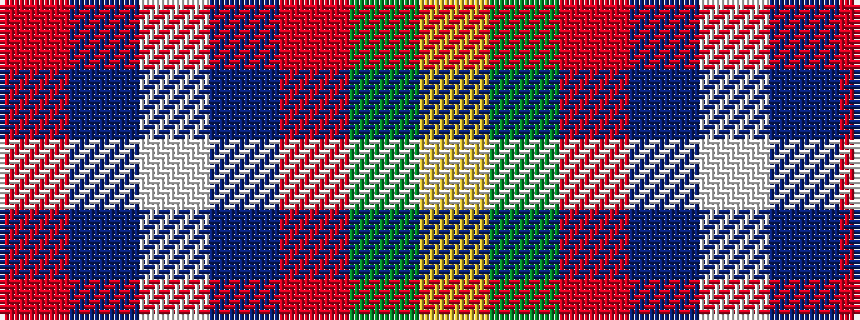

RBWBRGY

It is a 7 stripe tartan.

<figure class="pat-woven">

<figcaption>idealised sample</figcaption>
</figure>

## Colour Sequence



## Tartans with this colour sequence

| Tartans |
|---------------|
| [Edinburgh Fire (Corporate)](/variants/s7/ly2dy4r4n21w1n1ri1~x4/)|
||
