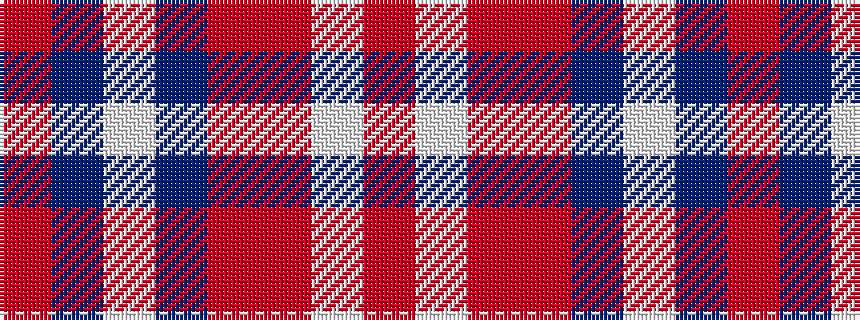

RBWBRRWR

It is a 8 stripe tartan.

<figure class="pat-woven">

<figcaption>idealised sample</figcaption>
</figure>

## Colour Sequence



## Tartans with this colour sequence

| Tartans |
|---------------|
| [Longniddry Dress, Red (Dance)](/setts/s8/r35db2w2db2r4r10w25r3~x2/)|
||
