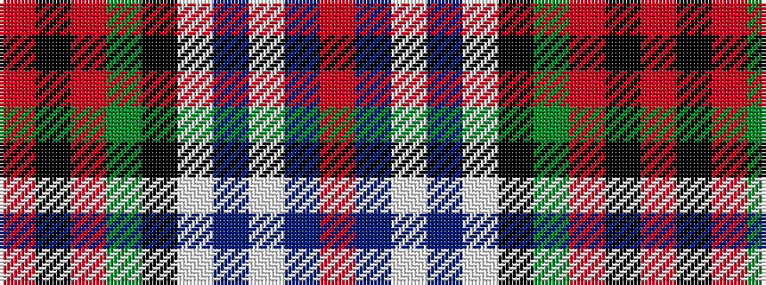

RBWBWKGRKR

It is a 10 stripe tartan.

<figure class="pat-woven">

<figcaption>idealised sample</figcaption>
</figure>

## Colour Sequence



## Tartans with this colour sequence

| Tartans |
|---------------|
| [MacDuff Dress #2](/setts/s10/r4k1r4g8k6lb3db2lb11db1r2~x4/)|
||
| [MacDuff, dress](/setts/s10/r5k1r5g9k7w3db3w15db1r2~x2/)|
||
