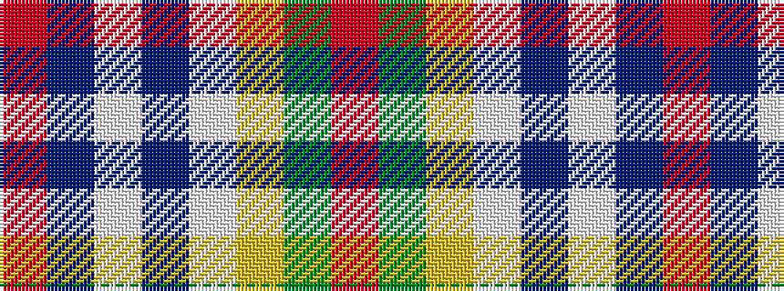

RBWBWYGR

It is a 8 stripe tartan.

<figure class="pat-woven">

<figcaption>idealised sample</figcaption>
</figure>

## Colour Sequence



## Tartans with this colour sequence

| Tartans |
|---------------|
| [Raymond of Doune](/setts/s8/r4dg10lo1lb1dt4lb1dt25r2~x2/)|
||
