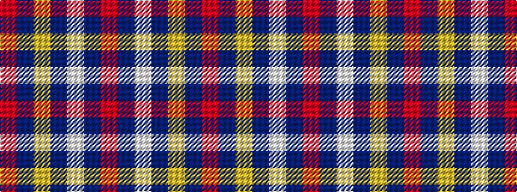

RBWBYBR

It is a 7 stripe tartan.

<figure class="pat-woven">

<figcaption>idealised sample</figcaption>
</figure>

## Colour Sequence



## Tartans with this colour sequence

| Tartans |
|---------------|
| [Texas Lone Star](/variants/s7/r50db14w6db9ly3db4r4~x2/)|
||
| [Texas Lone Star (Fashion)](/variants/s7/r50db14w6db9lo3db4r4~x2/)|
||
