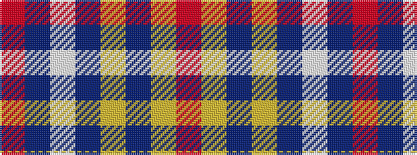

RBWBYBYR

It is a 8 stripe tartan.

<figure class="pat-woven">

<figcaption>idealised sample</figcaption>
</figure>

## Colour Sequence



## Tartans with this colour sequence

| Tartans |
|---------------|
| [Earl of Inverness (Royal)](/setts/s8/r100dbi10w5dbi14ly4db8ly4r24/)|
||
| [Princess Elizabeth #2](/setts/s8/r60db8w3db10ly3t4ly3r19~x2/)|
||
