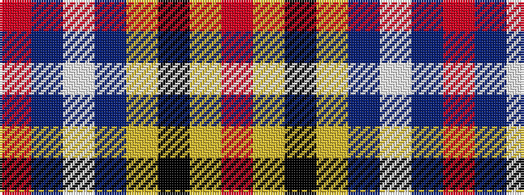

RBWBYKYR

It is a 8 stripe tartan.

<figure class="pat-woven">

<figcaption>idealised sample</figcaption>
</figure>

## Colour Sequence



## Tartans with this colour sequence

| Tartans |
|---------------|
| [Inverness #2](/variants/s8/r114db10w3db16ly3k3ly3r28~x2/)|
||
