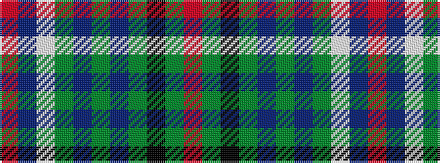

RBWGBGBGKGR

It is a 11 stripe tartan.

<figure class="pat-woven">

<figcaption>idealised sample</figcaption>
</figure>

## Colour Sequence



## Tartans with this colour sequence

| Tartans |
|---------------|
| [Adams](/setts/s11/r4g4k2g15do5g5do15g6w1db19r2~x2/)|
||
| [Adams (Name)](/setts/s11/r4g4k2g17do5g5do17g6lb1db22r2~x2/)|
||
