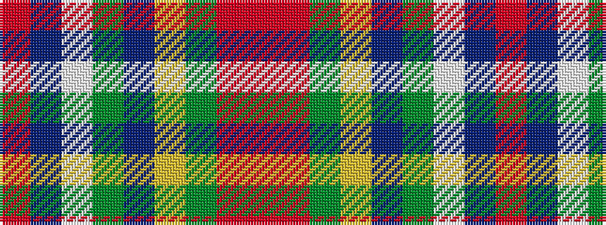

RBWGBYGRR

It is a 9 stripe tartan.

<figure class="pat-woven">

<figcaption>idealised sample</figcaption>
</figure>

## Colour Sequence



## Tartans with this colour sequence

| Tartans |
|---------------|
| [Bailey, Leslie A (Personal)](/setts/s9/r3db7w1gi6dbi5lo2g2o2r3~x2/)|
||
