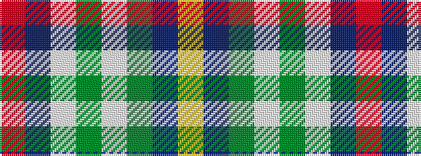

RBWGWGBY

It is a 8 stripe tartan.

<figure class="pat-woven">

<figcaption>idealised sample</figcaption>
</figure>

## Colour Sequence



## Tartans with this colour sequence

| Tartans |
|---------------|
| [Royal Troon Golf Club, The](/variants/s8/r3dt4w10dg2w2dg5dt34ly3~x2/)|
||
