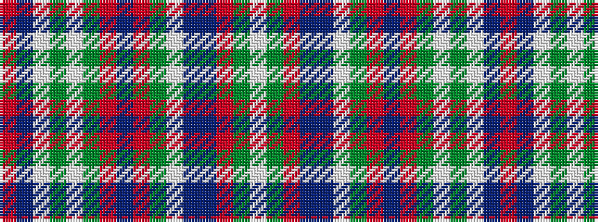

RBWGWGRBRGWBBRGW

It is a 16 stripe tartan.

<figure class="pat-woven">

<figcaption>idealised sample</figcaption>
</figure>

## Colour Sequence



## Tartans with this colour sequence

| Tartans |
|---------------|
| [North West Mounted Police](/setts/s16/r44do3w2g14w2y4r4do2r4y4w2dt12do6r6y7w2~x2/)|
||
| [North West Mounted Police (Commemo)](/setts/s16/r44do3lb2g14lb2y4r4do2r4y4lb2dt12do6r6y7lb2~x2/)|
||
