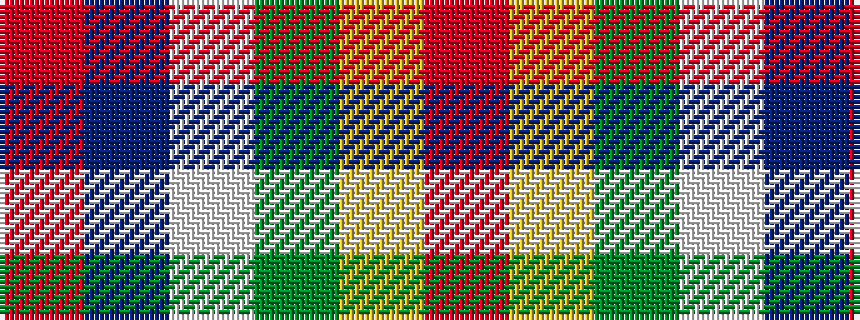

RBWGYR

It is a 6 stripe tartan.

<figure class="pat-woven">

<figcaption>idealised sample</figcaption>
</figure>

## Colour Sequence



## Tartans with this colour sequence

| Tartans |
|---------------|
| [Carleton College Rugby](/setts/s6/o5dt30w3dg15ly8r4~x2/)|
||
