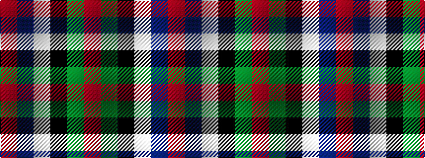

RBWKGR

It is a 6 stripe tartan.

<figure class="pat-woven">

<figcaption>idealised sample</figcaption>
</figure>

## Colour Sequence



## Tartans with this colour sequence

| Tartans |
|---------------|
| [Caithness (1848) (District?)](/variants/s6/r40t11w2k12g36r32~x2/)|
||
| [Sinclair](/variants/s6/r30g12k5w2t6r30/)|
||
| [Sinclair](/variants/s6/r28g16k4w1t6r28~x2/)|
||
| [Sinclair](/variants/s6/r36t8w1k5g20r18~x4/)|
||
| [Sinclair (Logan)](/variants/s6/r28g16k4w1db6r28~x2/)|
||
| [Thompson/Thomson/MacTavish (Mackinlay)](/variants/s6/r40t11w2k12dg36r32~x2/)|
||
