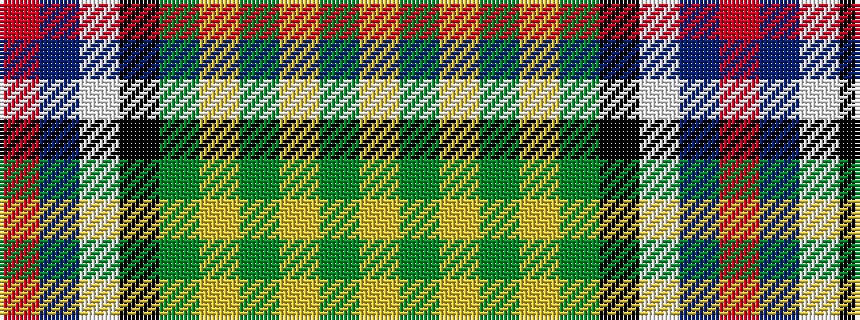

RBWKGYGYGY

It is a 10 stripe tartan.

<figure class="pat-woven">

<figcaption>idealised sample</figcaption>
</figure>

## Colour Sequence



## Tartans with this colour sequence

| Tartans |
|---------------|
| [Crookdake Cheng](/variants/s10/r3db36w10k8g13ly6g3ly3g3ly1~x2/)|
||
| [Crookdake Cheng Family Tartan](/variants/s10/r3db36lb10k8g13lo6g3lo3g3lo1~x2/)|
||
| [Crookdake-Cheng (Personal)](/variants/s10/r2db24lb6k6g6ly4g2ly2g2ly1~x2/)|
||
