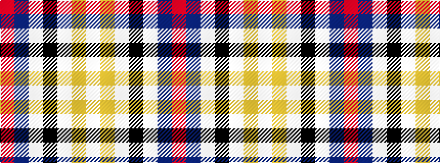

RBWKWYW

It is a 7 stripe tartan.

<figure class="pat-woven">

<figcaption>idealised sample</figcaption>
</figure>

## Colour Sequence



## Tartans with this colour sequence

| Tartans |
|---------------|
| [Barbour -Modern](/variants/s7/lb4ly2lb21k11w2n21r2~x2/)|
||
