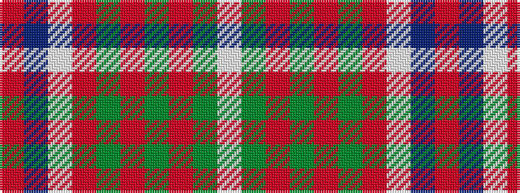

RBWRGRGRGW

It is a 10 stripe tartan.

<figure class="pat-woven">

<figcaption>idealised sample</figcaption>
</figure>

## Colour Sequence



## Tartans with this colour sequence

| Tartans |
|---------------|
| [Tennessee](/variants/s10/r2db10w1m1dg1r1dg6m1dg10w1~x2/)|
||
| [Tennessee](/variants/s10/r2db10w1m1g1r1g6m1g10w1~x2/)|
||
