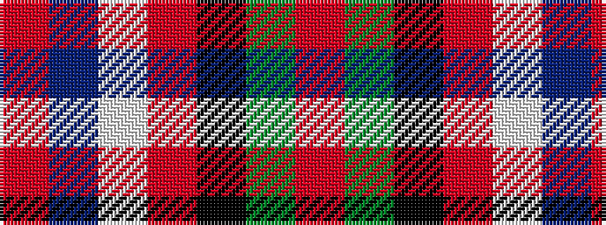

RBWRKGR

It is a 7 stripe tartan.

<figure class="pat-woven">

<figcaption>idealised sample</figcaption>
</figure>

## Colour Sequence



## Tartans with this colour sequence

| Tartans |
|---------------|
| [Ascension Island Heritage Trust](/setts/s7/r8t45w1o4k11g6r4~x2/)|
||
