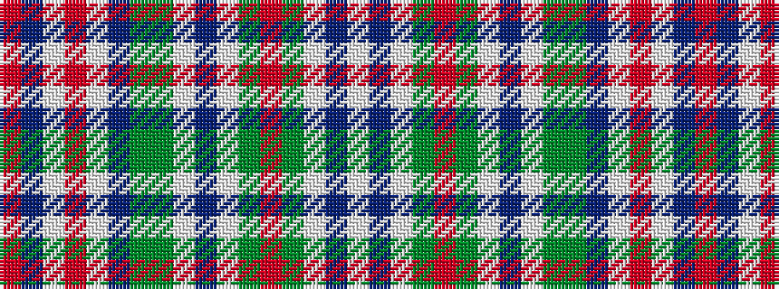

RBWRWBGGWBWGRGWBW

It is a 17 stripe tartan.

<figure class="pat-woven">

<figcaption>idealised sample</figcaption>
</figure>

## Colour Sequence



## Tartans with this colour sequence

| Tartans |
|---------------|
| [Jacobite Dress General Tartan Tartan Number: 1665. Earliest known date: pre 2003 See Jacobite file for report on 2nd pivot. See products available Copyright © Blair Urquhart, Comrie, 2015](/setts/s17/r16do4w6r6w20do15g4dy15w1do3w1dy5r6g4w3db3w3~x2/)|
||
