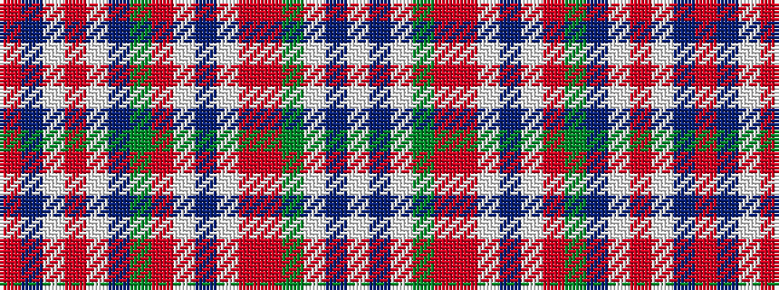

RBWRWBGRWBWRRGWBW

It is a 17 stripe tartan.

<figure class="pat-woven">

<figcaption>idealised sample</figcaption>
</figure>

## Colour Sequence



## Tartans with this colour sequence

| Tartans |
|---------------|
| [Jacobite, dress](/setts/s17/r16dr4w6r6w20dr15g4o15w1dr3w1o5r6g4w3db3w3~x2/)|
||
