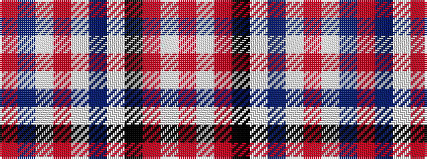

RBWRWBWKRWR

It is a 11 stripe tartan.

<figure class="pat-woven">

<figcaption>idealised sample</figcaption>
</figure>

## Colour Sequence



## Tartans with this colour sequence

| Tartans |
|---------------|
| [Bear Baars (Personal)](/setts/s11/ri2db2w2r1w2db10w1k2ri10w1ri2~x4/)|
||
