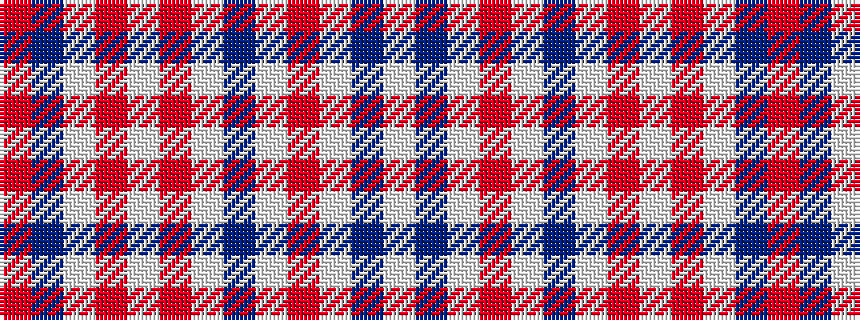

RBWRWRWBWRWBW

It is a 13 stripe tartan.

<figure class="pat-woven">

<figcaption>idealised sample</figcaption>
</figure>

## Colour Sequence



## Tartans with this colour sequence

| Tartans |
|---------------|
| [Fiona](/setts/s13/lp16do2lp2o2lp2do24w2o1w1o1w12do1o2~x4/)|
||
