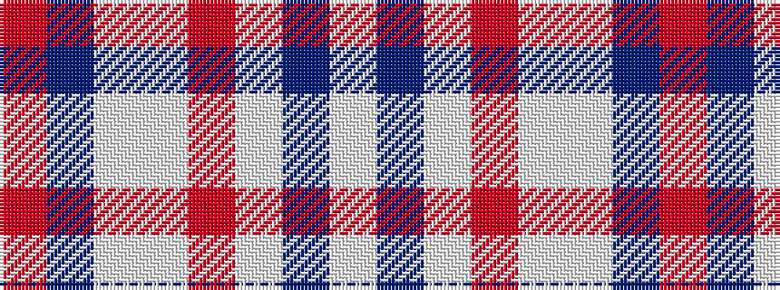

RBWWRWBW

It is a 8 stripe tartan.

<figure class="pat-woven">

<figcaption>idealised sample</figcaption>
</figure>

## Colour Sequence



## Tartans with this colour sequence

| Tartans |
|---------------|
| [Wyckoff (Commemorative)](/variants/s8/lb70b5lb3ri5lb3w5b3r5~x2/)|
||
