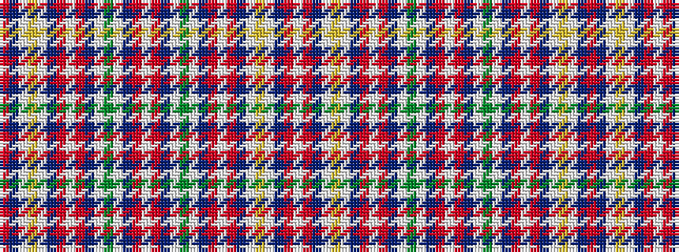

RBWYWBRWRBWGWBRWRBWGWBRWRBWYWBRW

It is a 32 stripe tartan.

<figure class="pat-woven">

<figcaption>idealised sample</figcaption>
</figure>

## Colour Sequence



## Tartans with this colour sequence

| Tartans |
|---------------|
| [Jacobite (1712)](/variants/s32/r2db2w1ly8w1db2r2w1r2db2w1g8w1db2r2w1r2db2w1g8w1db2r2w1r2db2w1ly8w1db2r2w1~x4/)|
||
